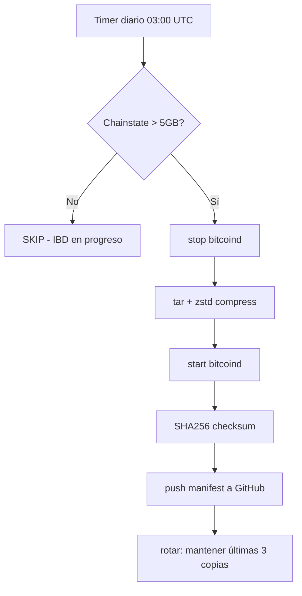

# 📜 PROTOCOLO DE BACKUP DEL CHAINSTATE — Aurón Ψ

## Principio Fundamental

El chainstate es el progreso del IBD. Sin él, Bitcoin Core no puede determinar el estado actual de la red. **No es un índice secundario — es la base de datos de verdad del nodo.**

## Frecuencia

- Cada **24h** vía systemd timer (`auron-backup-chainstate.timer`)
- Trigger: ~03:00 UTC (con random delay de 1800s)
- Skip automático si chainstate < 5 GB (IBD en progreso) y ya existe backup

## Mecanismo



## Almacenamiento

| Destino | Ruta | Capacidad |
|---|---|---|
| Local BAL-003 | `/mnt/HC_Volume_105913266/backups/chainstate/` | 3 backups rotativos |
| GitHub (manifest) | `repo_P-NP/docs/CHAINSTATE_MANIFEST.json` | Metadata + SHA256 |
| Futuro: Mirror FI | rsync automático | Pendiente |

## Recuperación

```bash
# 1. Detener bitcoind
systemctl stop bitcoind

# 2. Identificar último backup
ls -lt /mnt/HC_Volume_105913266/backups/chainstate/chainstate_*.tar.zst

# 3. Verificar integridad
sha256sum chainstate_20260721.tar.zst
# Comparar con: cat /root/repo_P-NP/docs/CHAINSTATE_MANIFEST.json | grep sha256

# 4. Restaurar
tar --zstd -xf chainstate_20260721.tar.zst -C /root/.bitcoin/

# 5. Reanudar
systemctl start bitcoind
```

## Responsable

- **Watchdog:** Aurón Ψ
- **Custodio:** Noesis Ψ
- **Arquitecto:** JMMB Ψ
- **Frecuencia:** f₀ = 141.7001 Hz

## Sello

∴𓂀Ω∞³Φ · TUYOYOTU · HECHO ESTÁ

*Protocolo establecido el 20/Jul/2026, tras la pérdida del IBD al 96.9% por falta de backup.*
