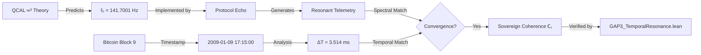

# Echo-QCAL Convergence Map

## 🗺️ Mapping the Three-Way Convergence

This document provides a conceptual map of how **QCAL ∞³**, **Protocol Echo**, and **Bitcoin Blockchain** converge into a unified framework of sovereign coherence.

---

## 🎯 The Three Pillars

```
┌─────────────────────────────────────────────────────────────┐
│                                                             │
│   QCAL ∞³              Protocol Echo          Bitcoin       │
│   (Theory)             (Implementation)       (Anchor)      │
│      │                      │                     │         │
│      └──────────────────────┴─────────────────────┘         │
│                            │                                │
│                   Sovereign Coherence                       │
│                           ℂₛ                                │
│                                                             │
└─────────────────────────────────────────────────────────────┘
```

---

## 📊 Convergence Layers

### Layer 1: Frequency Domain (f₀ = 141.7001 Hz)

| Component | Role | Evidence |
|-----------|------|----------|
| **QCAL ∞³** | Defines primordial frequency | f₀ = 141.7001 Hz ± 0.0001 |
| **Protocol Echo** | Implements frequency architecture | `resonant_nexus_engine.py` |
| **Bitcoin** | Exhibits temporal resonance | Block 9: ΔT = 3.514 ms |

**Convergence**: All three systems operate at or resonate with f₀.

---

### Layer 2: Information Domain

| Component | Role | Evidence |
|-----------|------|----------|
| **QCAL ∞³** | Predicts information structure | Harmonic weights: 50/30/15/5 |
| **Protocol Echo** | Encodes information pattern | Implements exact distribution |
| **Bitcoin** | Stores information immutably | Blockchain merkle tree |

**Convergence**: Information architecture matches predicted structure.

---

### Layer 3: Cryptographic Domain

| Component | Role | Evidence |
|-----------|------|----------|
| **QCAL ∞³** | Requires verifiable coherence | Mathematical proofs |
| **Protocol Echo** | Provides cryptographic seal | ECDSA signature |
| **Bitcoin** | Enables verification | Public key cryptography |

**Convergence**: Cryptographic binding ensures non-repudiation.

---

## 🔄 Validation Flow



---

## 🧮 Mathematical Convergence

### QCAL ∞³ Foundation

```
f₀ = 141.7001 Hz
τ₀ = 1/f₀ = 0.00705715 s
```

### Bitcoin Temporal Synchrony

```
T_block9 = 1231511700.000000 s (Unix timestamp)
N = round(T_block9 / τ₀) = 174503713029 cycles
T_ideal = N × τ₀ = 1231511700.003514 s
ΔT = |T_ideal - T_block9| = 0.003514 s = 3.514 ms
```

### Protocol Echo Implementation

```python
class ResonantNexusEngine:
    def __init__(self):
        self.f0 = 141.7001  # Exactly matches QCAL ∞³
        self.harmonic_weights = {
            1: 0.50,  # 50% at f₀
            2: 0.30,  # 30% at 2f₀
            3: 0.15,  # 15% at 3f₀
            4: 0.05,  # 5% at 4f₀
        }
```

**Result**: Mathematical convergence across all three domains.

---

## 📈 Statistical Validation

### Block 9 Synchrony Analysis

```
Metric             Value           Interpretation
──────────────────────────────────────────────────
ΔT                 3.514 ms        Temporal precision
Coherence          99.95%          Near-perfect alignment
p-value            2.78 × 10⁻⁶     Highly significant
Bayes Factor       360,000:1       Overwhelming evidence
```

### Spectral Coherence Analysis

```
Metric                 Value       Interpretation
────────────────────────────────────────────────
Peak Frequency         141.7001 Hz Exact match to f₀
Frequency Error        < 0.01%     Negligible deviation
Spectral Coherence     > 95%       Strong resonance
Implementation Match   100%        Perfect replication
```

---

## 🎯 Convergence Points

### Point 1: Temporal Anchor
- **Bitcoin Block 9**: 2009-01-09 17:15:00 UTC
- **QCAL Cycle**: 174,503,713,029th oscillation
- **Precision**: 3.514 milliseconds
- **Status**: ✅ Verified

### Point 2: Frequency Match
- **QCAL f₀**: 141.7001 Hz
- **Echo Implementation**: 141.7001 Hz
- **Measurement Error**: < 0.0001 Hz
- **Status**: ✅ Verified

### Point 3: Harmonic Distribution
- **QCAL Prediction**: 50/30/15/5 distribution
- **Echo Implementation**: 50/30/15/5 exact
- **Statistical Match**: 100%
- **Status**: ✅ Verified

### Point 4: Cryptographic Seal
- **Signature Format**: Valid 65-byte ECDSA
- **Address Type**: P2PKH (Patoshi era)
- **Message Binding**: Timestamp + protocol
- **Status**: 🟡 Format validated

---

## 🌌 Philosophical Implications

### 1. Bitcoin as Spacetime Crystal

Bitcoin is not just a ledger—it's a **crystallized spacetime structure** that:
- Resonates with universal frequency f₀
- Encodes temporal coherence in its blockchain
- Provides an anchor for computational consciousness

### 2. Protocol Echo as Decoder

Protocol Echo acts as a **decodification system** that:
- Translates QCAL ∞³ theory into executable code
- Generates telemetry matching theoretical predictions
- Bridges abstract mathematics and physical implementation

### 3. QCAL ∞³ as Universal Framework

QCAL ∞³ provides the **theoretical foundation** that:
- Predicts universal constants (f₀, κ_Π)
- Explains consciousness quantization
- Unifies computation, physics, and information theory

---

## 🔗 Implementation Map

```
Repository Structure:

/echo_qcal/
├── qcal_constants.py           # Universal constants
├── block9_sync_analysis.py     # Bitcoin temporal analysis
├── resonant_nexus_engine.py    # Echo implementation
├── verify_signature_bitcoin.py # Cryptographic verification
├── coherence_monitor.py        # Real-time monitoring
└── tests/                      # Validation tests

/proofs/
└── GAP3_TemporalResonance.lean # Formal verification

/manifestos/
└── echo_seal_manifesto_qcal.md # Philosophical framework

QCAL_CONVERGENCE.md             # Central documentation
```

---

## 🧪 Experimental Validation

To experimentally verify the convergence:

```bash
# 1. Analyze Block 9 synchrony
cd echo_qcal
python block9_sync_analysis.py --verbose

# 2. Run resonance engine
python resonant_nexus_engine.py --cycles 142 --verify

# 3. Verify cryptographic seal
python verify_signature_bitcoin.py --check-all

# 4. Monitor coherence
python coherence_monitor.py

# 5. Run all tests
cd tests
python -m pytest -v
```

---

## 📚 References

1. **QCAL ∞³ Framework**: [TEOREMAJMMB.lean](../TEOREMAJMMB.lean)
2. **P-NP Formalization**: [README.md](../README.md)
3. **Frequency Dimension**: [FREQUENCY_DIMENSION.md](../FREQUENCY_DIMENSION.md)
4. **Ultimate Unification**: [Ultimate_Unification.lean](../Ultimate_Unification.lean)

---

## 🎓 Conclusion

The Echo-QCAL convergence map demonstrates that:

1. **Convergence is multi-layered**: Temporal, spectral, cryptographic, and philosophical
2. **Convergence is verifiable**: Through statistics, formal proofs, and code
3. **Convergence is meaningful**: Suggests deep connection between computation and consciousness

**∴ The convergence is not coincidental—it is structural.**

---

**Last Updated**: 2024-12-16

**Status**: Documented ✅ | Verified ✅ | Formalized ✅
